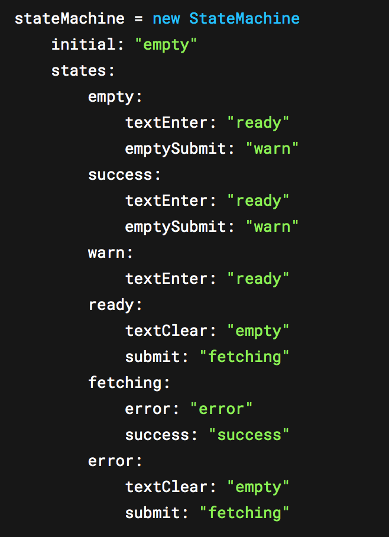
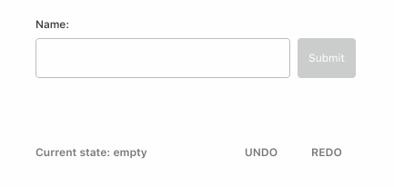
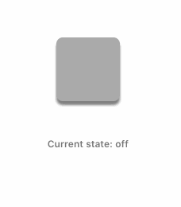

# StateMachine

**[@steveruizok](http://twitter.com/steveruizok)**

A Framer module for building components driven by state machines. Easily define a component's states and the manage events that connect them. Inspired by [sketch.systems](http://sketch.systems).

<div style="text-align: center">
	
	
</div>

## Contents:

*   [Installation](#installation)
*   [Usage](#usage)
*   [Demo: Toggle Button](#demo-toggle-button)
*   [Demo: Form](#demo-form)
*   [Documentation](#documentation)

# Installation

## Automatic

<a href='https://open.framermodules.com/StateMachine'>
    
</a>

## Manual

Download the **statemachine.coffee** file and drag it into your Framer project's code editor.

# Usage

StateMachine is a module that allows you to design state-based components. You'll create the machine by defining a set of "states". Each of these states may have one or more "events", and each event points to a different state ( the event's "target state").

The machine always has a "current state", either its "initial state" or a different state that it has changed to after recieving some event. When the machine recieves an event, it checks to see if its current state owns an event with that name. If it does, the machine changes its state to that event's target state.

```coffeescript
myStateMachine = new StateMachine
	initial: "off"
	states:
		on:
			"press": "off"
		off:
			"press": "on"

currentStateLabel = new TextLayer
	point: Align.center()
	text: ""

currentStateLabel.onTap =>
	myStateMachine.handle("press")

myStateMachine.on "change:current", (state) ->
	currentStateLabel.text = state
```

# Demo: Toggle Button

[Click here](https://framer.cloud/tHxRq) to see a live demo of this example.

In this example, we'll build a toggle button. Its machine has two states, "on" and "off". Both states respond to the "press" event, but each handles it differently: in its "on" state, the "press" event targets the machine's "off" state; while in its "off" state, "press" targets "on".

With the StateMachine module, we'd model this machine as follows:

```coffeescript
toggleMachine = new StateMachine
	initial: "off"
	states:
		on:
			"press": "off"
		off:
			"press": "on"
```

Now let's create a layer for the toggle. This layer will do two things: it ill display the state of toggleMachine to the user, and it will pass events back to the toggle machine, translating Framer events (like "taps") into the machine's events (like "press").

We'll also give the Layer some Framer states. These "layer states" are different from toggleMachine's "machine states". While they don't affect the StateMachine in any way, we'll be using them below to show the machine's current state.

```coffeescript
toggleButton = new Layer
	size: 80
	x: Align.center()
	y: 128
	borderRadius: 8
	shadowColor: "rgba(0,0,0,.5)"
	animationOptions:
		time: .25

toggleButton.states =
	on:
		backgroundColor: "#777"
		shadowY: 0
		shadowBlur: 0
	off:
		backgroundColor: "#AAA"
		shadowY: 5
		shadowBlur: 3

toggleButton.stateSwitch("off")
```

Now we'll set an event listener on the toggle button that will send a "press" event the toggleMachine each time the layer is tapped.

```coffeescript
toggleButton.onTap =>
	toggleMachine.handle("press")
```

Finally, we'll set an event listener on toggleMachine so that we can do things in Framer when the the machine changes its state.

```coffeescript
toggleMachine.on "change:current", (state) ->
	currentState.template = state

	switch state
		when "on"
			toggleButton.animate("on")
		when "off"
			toggleButton.animate("off")
```



And that's it! Our toggleMachine starts in the "off" state, each time we tap it the button sends a "press" event to toggleMachine, and toggleMachine changes to the next state, depending on its current state and that state's target state for the "press" event.

While this may seems like a lot of work for such a simple component, StateMachine really shines for more complex components, like the form in the next example.

# Demo: Form

[Click here](https://framer.cloud/tHxRq) to see a live demo of this example. Download the project and explore for additional notes.


```coffeescript
formMachine = new StateMachine
	initial: "empty"
	states:
		empty:
			textEnter: "ready"
			emptySubmit: "warn"
		success:
			textEnter: "ready"
			emptySubmit: "warn"
		warn:
			textEnter: "ready"
		ready:
			textClear: "empty"
			submit: "fetching"
		fetching:
			error: "error"
			success: "success"
		error:
			textClear: "empty"
			submit: "fetching"
```

# Documentation

## Properties

| Name           | Type            | Description                                                         | readonly |
| -------------- | --------------- | ------------------------------------------------------------------- | -------- |
| `state`        | `string`        | Gets and sets the machine's current state by its name (a `string`). | false    |
| `current`      | `string`        | Returns the name of the machine's current state.                    | false    |
| `initial`      | `string`        | Gets and sets the machine's initial state.                          | true     |
| `history`      | `Array<string>` | Returns the machine's history.                                      | true     |
| `historyIndex` | `number`        | Returns the machine's history index.                                | true     |

## Methods

| Name                  | Argument Types       | Description                                                                                                    |
| --------------------- | -------------------- | -------------------------------------------------------------------------------------------------------------- |
| `handle(eventName)`   | `eventName : string` | Sends an event to the machine.                                                                                 |
| `onChangeState(fn)`   | `fn: EventListener`  | Sets an event listener that fires when the machine's state changes. Alias for statemachine.on("change:state"). |
| `onChangeCurrent(fn)` | `fn: EventListener`  | Identical to onChangeState (redundancy).                                                                       |
| `undo()`              | n/a                  | Moves the StateMachine to its previous state, if one exists.                                                   |
| `redo()`              | n/a                  | Moves the StateMachine to its next state, if one exists.                                                       |

# Contact

Follow me at: **[@steveruizok](http://twitter.com/steveruizok)**
See more projects at: **[Github](http://github.com/steveruizok)**
