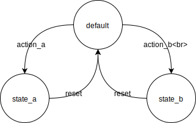

# StateMachine

**[@steveruizok](http://twitter.com/steveruizok)**

A Framer module for designing with finite state machines. Easily define a component's states and the manage the actions that connect them. Inspired by [sketch.systems](http://sketch.systems).

<div style="text-align: center">
	<br/>
	
</div>

## Contents:

- [Installation](#installation)
- [Usage](#usage)
- [Demo: Toggle Button](#demo-toggle-button)
- [Demo: Form](#demo-form)
- [Documentation](#documentation)

# Installation

## Automatic

<a href='https://open.framermodules.com/StateMachine'>
    
</a>

## Manual

First download the **statemachine.coffee** file and drag it into your Framer project's `modules` folder. 

Then, at the top of your Framer project's code, type `{ StateMachine } = require "statemachine"`.

# Usage

StateMachine is a module that allows you to design "finite state machine"s to control the logic of your components.



To see this example in action, [click here](https://framer.cloud/lpCQp).

### States

The StateMachine itself is made up of a set of states. At any given time, the machine will always be in one of these states; and it will never be more than one state at a time. In the example below, we're creating a machine with three states: `default`, `state_a`, and `state_b`.

```coffeescript
myStateMachine = new StateMachine
	initial: "default"
	states:
		default:
			action_a: "state_a"
			action_b: "state_b"
		state_a:
			reset: "default"
		state_b:
			reset: "default"
```


### Actions

Each of a StateMachine's states may have one or more "response"s. These pair the name of an action and the name of a state. In the example above, `state_a`'s first response, `{action_b: "state_b"}` pairs the action `action_b` and to the state name `"state_b"`.

### Dispatching Actions

You can send "actions" to the machine using the `machine.dispatch()` method. The method accepts two arguments: 1) the name of the action you're sending, and 2) an optional "payload" of data.

```coffeescript
layer_a.onTap =>
	myStateMachine.dispatch( "action_a", new Date() )

layer_b.onTap =>
	myStateMachine.dispatch( "action_b", new Date() )

reset_button.onTap =>
	myStateMachine.dispatch( "reset", new Date() )
```

In this example, tapping on the layer `layer_a` dispatches the action `action_a` to the machine, along with a payload (a `Date` object).

### Responding to an Action

When the machine recieves an action, it checks to see if its current state has an response for that action. If it does not have a response for the action, the machine will ignore the action -- but if it does have a response, the machine will change its state to the state indicated in that response.

If our example machine was in `default` and we tapped on `layer_a`, the machine would respond to the dispatched action, `action_a`, by changing its state to `state_a`. If we then tapped `layer_a` again, the machine would ignore the action, as its now-current state, `state_a`, has no response for `action_a`. 

Likewise, our machine has no path between `state_a` and `state_b`: the machine would ignore all `action_a` and `action_b` dispatches while in either of these states. In order to move from one to the other, the machine would have to first return to the `default` state (using a `reset` action).

### Listening for State Changes

When a state machine changes its state, it emits an event, `"change:state"` that can be called with two arguments: 1) the name of its new current state, and 2) the payload sent with the preceding action. (This event has an alias, `machine.onStateChange`.) You can use this event, along with a `switch` statement, to decide how to represent the machine's current state to your user.

```coffeescript
myStateMachine.onStateChange, (current, payload) ->

	switch current
		when "state_a"
			layer_a.backgroundColor = "#ff0000"
			layer_b.backgroundColor = "#cccccc"
		when "state_b"
			layer_a.backgroundColor = "#cccccc"
			layer_b.backgroundColor = "#ff0000"
		when "default"
			layer_a.backgroundColor = "#cccccc"
			layer_b.backgroundColor = "#cccccc"
```

You can also use the payload send with the state change event to make more complex changes in your project.

```coffeescript
myStateMachine.onStateChange (current, payload) ->
	if payload instanceof Date
		print payload.toLocaleString() +  ": changed state to " + current
```

To see this example in action, [click here](https://framer.cloud/lpCQp).

# Demo: Toggle Button

[Click here](https://framer.cloud/tHxRq) to see a live demo of this example.

In this example, we build a simple toggle button: it cna be either on or off.


# Demo: Form

[Click here](https://framer.cloud/tHxRq) to see a live demo of this example. 

In this second example, we deal with a more complex set of states and relationships that model an asynchronous submission form.


# Documentation

## Properties

| Name           | Type            | Description                                                         | readonly |
| -------------- | --------------- | ------------------------------------------------------------------- | -------- |
| `state`        | `string`        | Gets and sets the machine's current state by its name (a `string`). | false    |
| `current`      | `string`        | Returns the name of the machine's current state.                    | false    |
| `initial`      | `string`        | Gets and sets the machine's initial state.                          | true     |
| `history`      | `Array<string>` | Returns the machine's history.                                      | true     |
| `historyIndex` | `number`        | Returns the machine's history index.                                | true     |

## Methods

| Name                  | Argument Types       | Description                                                                                                    |
| --------------------- | -------------------- | -------------------------------------------------------------------------------------------------------------- |
| `dispatch(action, paylaod)`   | `action : string`, `payload: any` | Dispatches an action to the machine.                                                                                 |
| `onChangeState(fn)`   | `fn: EventHandler`  | Sets an event listener that fires when the machine's state changes. Alias for `machine.on("change:state")`. |                                                               |
| `undo()`              | n/a                  | Moves the StateMachine to its previous state, if one exists.                                                   |
| `redo()`              | n/a                  | Moves the StateMachine to its next state, if one exists.                                                       |

# Contact

Follow me at: **[@steveruizok](http://twitter.com/steveruizok)**

See more projects at: **[Github](http://github.com/steveruizok)**

Find me in the **[Framer Slack channel](https://framer-slack-signup.herokuapp.com/)**